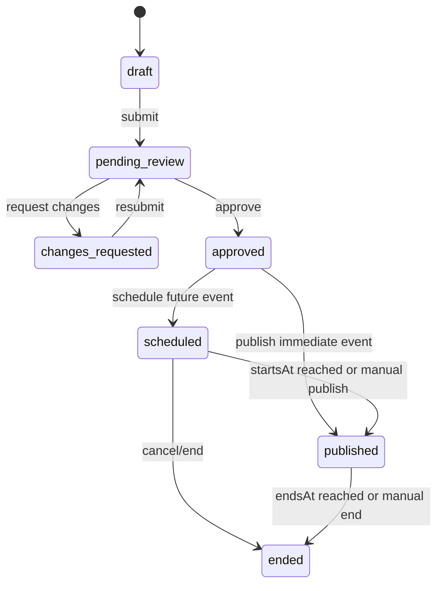

# Managed Fan Events Design

## Goal

팬앱 홈과 이벤트 화면을 정적인 배너 모음이 아니라 운영 가능한 서비스 기능으로 만든다. 관리자가 이벤트를 작성하고, 권한에 따라 검수·예약·공개하며, 팬은 관심 아티스트와 공개 시점에 맞는 이벤트를 홈·목록·상세에서 일관되게 확인할 수 있어야 한다.

이 설계는 기존 `Drop`을 대체하지 않는다. `Drop`은 카드 발행 묶음과 공개 조건을 담당하고, 새 `Event`는 팬에게 보여 주는 편집·프로모션 콘텐츠와 연결 동선을 담당한다.

## Product Boundaries

### Event

- 팬에게 노출되는 제목, 설명, 이미지, 기간, CTA를 가진 운영 콘텐츠다.
- 서비스 전체 또는 특정 아티스트를 대상으로 할 수 있다.
- 카드 드롭, 단일 카드, 팬 미션, 외부 페이지 중 하나를 선택적으로 연결한다.
- 관리자 검수와 예약 공개를 거쳐 팬앱에 노출된다.

### Drop

- 발행할 카드 묶음과 카드 공개 상태를 관리한다.
- 이벤트가 연결될 수 있지만 이벤트 자체의 배너, 소개 문구, 홈 노출 우선순위는 가지지 않는다.
- 이벤트 종료가 드롭이나 카드 공개를 자동으로 종료시키지 않는다.

### Achievement

- 팬 미션의 조건과 보상을 관리한다.
- 이벤트가 미션을 소개하고 진입점을 제공할 수 있지만 진행도와 보상 지급은 기존 Achievement 도메인이 담당한다.

## User Experience

### Fan home

- 별도의 큰 `홈` 제목은 표시하지 않고 브랜드 헤더 다음에 바로 콘텐츠를 보여 준다.
- 첫 영역은 현재 공개 중인 `featured` 이벤트다.
- 대표 이벤트가 없으면 가장 가까운 예정 이벤트를 표시하고, 둘 다 없으면 관심 아티스트 탐색 CTA를 보여 준다.
- 다음 영역은 관심 아티스트, 신규 공개 카드, 가까운 예정 이벤트 순서다.
- 이벤트 CTA는 연결 유형에 따라 이벤트 상세, 드롭 카드 목록, 단일 카드 상세, 팬 미션, 외부 링크로 이동한다.

### Fan event list

- 하단 홈 탭 또는 홈의 `전체 이벤트`에서 `/events`로 이동한다.
- `진행 중 · 예정 · 종료` 탭, 아티스트 필터, 페이지네이션을 제공한다.
- 기본 정렬은 진행 중 `priority DESC, startsAt DESC`, 예정 `startsAt ASC`, 종료 `endsAt DESC`다.
- 카드 전체를 눌러 상세로 이동하며 CTA가 명확한 경우 보조 버튼을 함께 제공한다.
- 종료 이벤트는 기본 보관 기간 90일까지만 공개 목록에 남긴다.

### Fan event detail

- 대표 이미지, 상태, 기간, 아티스트, 제목, 본문, CTA를 제공한다.
- 연결 대상이 카드 드롭이면 공개 가능한 카드만 미리 보여 준다.
- 연결 대상이 미션이면 현재 진행도와 미션 화면 링크를 제공한다.
- 연결 대상이 외부 URL이면 새 창 이동 전 외부 링크임을 표시한다.
- 비공개·삭제·권한 없는 이벤트 직접 URL은 404와 동일하게 처리한다.

### Admin event management

- 관리자 사이드바에 `이벤트` 메뉴를 추가한다.
- 목록 화면은 상태 탭, 검색, 아티스트, 유형, 기간 필터와 서버 페이지네이션을 제공한다.
- 행 전체 클릭으로 우측 상세/편집 패널을 연다.
- `새 이벤트`는 목록 상단 우측 액션으로 둔다.
- 편집기는 기본 정보, 대표 이미지, 노출 대상, 기간, 연결 대상, CTA, 홈 노출 설정을 단계 또는 섹션으로 나눈다.
- 우측 미리보기는 팬앱 홈 카드와 상세 헤더를 전환해 확인할 수 있다.
- 검수자는 같은 상세 패널에서 승인, 수정 요청, 즉시 공개, 예약 공개, 종료를 처리한다.

## Data Model

새 `events` 테이블을 추가한다.

| Field | Type | Rules |
| --- | --- | --- |
| `id` | string PK | `event_` prefix UUID |
| `organization_id` | nullable FK | `null`은 ROOT가 만든 서비스 전체 이벤트 |
| `artist_id` | nullable FK | 아티스트 대상 이벤트일 때 필수 |
| `title` | string | 1–100자 |
| `summary` | string | 1–180자, 목록·홈용 |
| `description` | text | 상세 본문, 최대 5,000자 |
| `hero_asset_id` | FK assets | 완료된 이미지 업로드만 허용 |
| `event_type` | enum string | `announcement`, `card_drop`, `card`, `fan_mission`, `external` |
| `workflow_status` | enum string | `draft`, `pending_review`, `changes_requested`, `approved`, `scheduled`, `published`, `ended` |
| `starts_at` | datetime | 공개 시작, timezone 필수 |
| `ends_at` | nullable datetime | 시작보다 늦어야 함 |
| `featured` | boolean | 홈 대표 후보 여부 |
| `priority` | integer | 0–100, ROOT만 변경 가능 |
| `cta_label` | nullable string | 기본 라벨은 유형별 파생 |
| `drop_id` | nullable FK | `card_drop`에서만 사용 |
| `card_id` | nullable FK | `card`에서만 사용 |
| `achievement_id` | nullable FK | `fan_mission`에서만 사용 |
| `external_url` | nullable string | `external`, HTTPS만 허용 |
| `review_note` | nullable string | 수정 요청 사유 |
| `created_by` | FK users | 작성 관리자 |
| `reviewed_by` | nullable FK users | 최근 검수자 |
| `published_at` | nullable datetime | 최초 공개 시각 |
| `notification_sent_at` | nullable datetime | 공개 알림 중복 방지 |
| `created_at`, `updated_at` | datetime | 감사용 |

인덱스는 `(workflow_status, starts_at)`, `(artist_id, workflow_status, starts_at)`, `(featured, priority)`를 둔다.

### Derived display status

팬앱 상태는 저장된 `workflow_status`와 시간을 조합해 계산한다.

- `scheduled`이고 `now < starts_at`: `upcoming`
- `scheduled` 또는 `published`이고 `starts_at <= now < ends_at`: `active`
- `ended`이거나 `ends_at <= now`: `ended`
- 그 외 상태는 팬에게 노출하지 않는다.

시간 경과만으로 행을 지속적으로 갱신할 필요는 없다. 공개 조회는 파생 상태를 사용하고, 관리 화면은 상태 라벨 옆에 현재 노출 상태를 함께 표시한다.

## Validation Rules

- `ends_at`은 `starts_at`보다 늦어야 한다.
- `hero_asset_id`는 `purpose=event_banner`이고 업로드 완료된 PNG, JPEG, WebP만 허용한다.
- 한 이벤트는 이벤트 유형에 맞는 연결 필드 하나만 사용할 수 있다.
- 연결된 드롭·카드·미션은 이벤트와 같은 조직 및 아티스트 범위여야 한다.
- `card_drop` 이벤트는 연결 드롭이 `scheduled` 또는 `live`이고 팬 공개 가능한 카드가 하나 이상일 때만 승인할 수 있다.
- `card` 이벤트는 연결 카드가 승인되어 있고 공개 가능한 드롭에 연결되었거나 이미 공개된 카드일 때만 승인할 수 있다.
- `fan_mission` 이벤트는 연결 Achievement가 `published`이며 이벤트 기간과 겹쳐야 한다.
- `external` 이벤트는 HTTPS URL만 허용한다.
- `featured=true` 이벤트가 여러 개면 `priority`, 시작 시각, 수정 시각 순으로 하나를 홈 대표로 선택한다.

## Roles and Permissions

새 권한은 `events:read`, `events:write`, `events:submit`, `events:review`, `events:publish`로 분리한다.

| Role | Read | Draft/Edit | Submit | Review | Publish/End |
| --- | --- | --- | --- | --- | --- |
| ROOT | all | all | yes | yes | yes |
| platform_operator | all | no | no | yes | no |
| company_admin | organization scope | yes | yes | no | no |
| manager | assigned artist scope | yes | yes | no | no |
| editor | assigned artist scope | yes | no | no | no |
| viewer | assigned scope | no | no | no | no |

- 파트너 관리자는 자신의 조직과 할당 아티스트 범위만 조회·편집한다.
- 서비스 전체 이벤트와 `priority` 변경은 ROOT만 가능하다.
- 작성자와 검수자는 같을 수 없도록 강제하지 않지만 모든 상태 전이를 감사 로그에 남긴다.

## Workflow

- 파트너가 `draft` 또는 `changes_requested`를 저장하고 제출한다.
- 검수자는 승인 전 모든 연결 대상과 이미지, 기간을 다시 검증한다.
- 검수 승인은 `approved`까지만 전이하고, `events:publish` 권한을 가진 ROOT가 미래 이벤트를 `scheduled`, 이미 시작 시각이 지난 이벤트를 `published`로 전이한다.
- 예약 이벤트의 팬 공개는 조회 시각 기준으로 자동 활성화된다.
- `notification_sent_at`이 없는 활성 이벤트는 idempotent 공개 작업에서 관심 팬에게 한 번만 알림을 생성한다.
- 자동 공개 작업은 재사용 가능한 서비스 함수로 만들고 배포 스케줄러에서 호출할 수 있게 한다. 스케줄러 장애 시 팬 이벤트 조회에서도 제한적으로 보정 호출하여 공개 누락을 방지한다.
- 이벤트 종료는 연결된 드롭, 카드, 미션의 상태를 변경하지 않는다.

## API Contracts

### Admin APIs

- `GET /api/admin/events`
  - query: `page`, `pageSize`, `q`, `status`, `artistId`, `type`, `startsFrom`, `startsTo`
  - response: `items`, `pagination`
- `POST /api/admin/events`
  - draft 생성
- `GET /api/admin/events/{eventId}`
  - 편집·검수에 필요한 연결 대상과 감사 요약 포함
- `PATCH /api/admin/events/{eventId}`
  - draft 또는 changes_requested만 파트너 편집 가능
- `POST /api/admin/events/{eventId}/submit`
- `POST /api/admin/events/{eventId}/review`
  - body: `{ decision: "approve" | "changes_requested", note? }`
- `POST /api/admin/events/{eventId}/publish`
  - ROOT의 즉시 공개 또는 예약 이벤트 수동 공개
- `POST /api/admin/events/{eventId}/end`
- `DELETE /api/admin/events/{eventId}`
  - 공개 이력이 없는 draft만 삭제 가능

모든 변경 API는 기존 `record_audit`를 사용해 `event.created`, `event.updated`, `event.submitted`, `event.reviewed`, `event.published`, `event.ended`, `event.deleted`를 기록한다.

### Fan APIs

- `GET /api/home`
  - personalized response: `featuredEvent`, `upcomingEvents`, `favoriteArtist`, `newCards`
  - 로그인 사용자의 `favoriteArtistIds`를 우선하고 없으면 서비스 대표 아티스트를 사용한다.
- `GET /api/events`
  - query: `page`, `pageSize`, `status=active|upcoming|ended`, `artistId`
  - 팬에게 공개 가능한 필드와 연결 요약만 반환한다.
- `GET /api/events/{eventId}`
  - 공개 가능한 이벤트 상세와 유형별 CTA 대상 반환
- `GET /api/events/{eventId}/hero`
  - 기존 Asset storage 응답 패턴을 재사용한다.

팬 응답에는 내부 `organization_id`, 검수 메모, 작성자, 감사 정보, 원본 asset storage 경로를 포함하지 않는다.

## Admin Form Behavior

- 기본 정보 저장은 draft를 만들며 이후 입력을 자동 저장할 수 있다.
- 이벤트 유형을 바꾸면 기존 연결 대상은 확인 후 제거한다.
- 연결 대상 선택기는 현재 관리자의 조직·아티스트 범위와 승인 가능 상태만 검색한다.
- 이미지 업로드는 기존 presign/complete 흐름에 `event_banner` purpose를 추가해 사용한다.
- 제출 버튼은 필수값과 연결 대상의 현재 상태를 선검증하고, 실패 항목을 섹션별로 표시한다.
- 검수 화면은 팬 홈 카드와 상세 화면 미리보기, 연결 대상, 예약 시간, 변경 이력을 한 화면에 제공한다.
- 공개된 이벤트의 본문 오탈자는 ROOT만 수정할 수 있고, 연결 대상·기간·노출 범위 변경은 새 검수 버전을 요구한다. 초기 구현에서는 공개 이벤트를 직접 수정하지 않고 복제 후 재검수하는 방식으로 제한한다.

## Notifications

- 대상은 이벤트의 `artist_id`를 관심 아티스트로 저장한 팬이다.
- 서비스 전체 이벤트는 마케팅 알림 수신 팬 전체가 대상이다.
- `event_scheduled` 알림은 선택 사항이며 초기 구현에서는 보내지 않는다.
- 활성화 시 `event_started` 알림을 한 번만 생성한다.
- `event_key=event_started:{eventId}`와 기존 Notification unique index로 재시도 중복을 막는다.
- 알림 클릭은 `/events/{eventId}`로 이동한다.

## Error and Empty States

- 팬 홈에 대표 이벤트가 없으면 이벤트 영역 대신 관심 아티스트 탐색 CTA를 표시한다.
- 이벤트 목록 결과가 없으면 선택된 필터를 유지하고 필터 초기화 액션을 제공한다.
- 연결 대상이 승인 후 비공개로 되돌아가면 이벤트는 팬 응답에서 제외하고 관리자에 `연결 확인 필요` 상태를 표시한다.
- 업로드가 완료되지 않은 이미지는 저장할 수 있지만 제출할 수 없다.
- 예약 시간이 지난 뒤 자동 공개 작업이 실패해도 시간 기반 팬 조회는 이벤트를 노출하고 알림만 재시도한다.

## Security and Audit

- 모든 관리자 이벤트 쿼리는 기존 `AdminContext`의 조직·아티스트 범위를 적용한다.
- 외부 URL은 HTTPS 스킴만 허용하고 팬앱에서는 `noopener noreferrer`로 연다.
- 이벤트 본문의 HTML 입력은 받지 않고 plain text를 줄바꿈 렌더링한다.
- 이미지 응답은 원본 storage path를 노출하지 않고 기존 storage response를 사용한다.
- 상태 전이와 중요 필드 변경은 변경 전후 값을 감사 로그 metadata에 남긴다.

## Testing

### Backend

- 모델 및 Alembic migration 업/다운
- 역할별 목록 범위와 권한 거부
- 유형별 연결 필드 검증
- 조직·아티스트 교차 연결 거부
- draft → submit → approve → scheduled/published → ended 전이
- 예약 시각 기반 active/upcoming/ended 파생
- 이벤트 페이지네이션·검색·필터·정렬
- 홈 대표 이벤트 우선순위와 관심 아티스트 개인화
- 비공개 이벤트 직접 조회 차단
- 공개 알림 idempotency
- event banner 업로드 목적과 이미지 MIME 검증

### Admin web

- 이벤트 메뉴와 권한별 노출
- 목록 서버 페이지네이션·필터 초기화
- 폼의 이벤트 유형별 연결 입력
- 제출 전 오류 요약
- 검수 승인·수정 요청·공개·종료 액션
- 팬 홈/상세 미리보기
- 키보드 행 선택과 모바일 단일 열 레이아웃

### Fan app

- 큰 홈 제목 없는 헤더
- 대표 이벤트, 관심 아티스트, 신규 카드, 예정 이벤트 구성
- 이벤트 목록 탭·필터·페이지네이션
- 이벤트 상세와 유형별 CTA
- 종료 이벤트와 빈 상태
- 다섯 개 하단 메뉴 및 중앙 홈 회귀

## Rollout

1. 데이터 모델, 권한, 관리자 API와 테스트를 먼저 배포한다.
2. 관리자 이벤트 목록·작성·검수 UI를 배포하고 ROOT 계정으로 QA 이벤트를 만든다.
3. 팬 이벤트 API와 홈·목록·상세 UI를 배포한다.
4. QA 이벤트를 예약 공개해 팬 노출, CTA, 알림 idempotency를 확인한다.
5. 기존 정적 홈 콘텐츠를 제거하고 이벤트 관리 화면을 공식 운영 경로로 전환한다.

## Out of Scope

- 사용자별 복잡한 세그먼트 빌더
- 푸시 알림 공급자 연동; 초기 구현은 기존 인앱 Notification 사용
- 이벤트 본문용 WYSIWYG/HTML 편집기
- 이벤트별 쿠폰·결제·응모 추첨 엔진
- 다국어 이벤트 번역 관리
- 공개 이벤트의 버전 비교 UI; 초기에는 복제 후 재검수

## Acceptance Criteria

- 관리자가 권한 범위 안에서 이벤트를 작성하고 검수 요청할 수 있다.
- ROOT 또는 검수자가 연결 대상과 예약 시간을 확인하고 승인·수정 요청할 수 있다.
- 승인된 이벤트는 예약 시각과 종료 시각에 따라 팬 홈·목록·상세에 일관되게 노출된다.
- 팬 홈은 실제 관리자 이벤트 데이터를 사용하며 정적 샘플 배너에 의존하지 않는다.
- 카드 드롭, 카드, 미션, 외부 링크 CTA가 각 도메인의 기존 공개 조건을 우회하지 않는다.
- 공개 알림은 팬별 이벤트당 한 번만 생성된다.
- 이벤트 목록은 관리자와 팬 양쪽에서 서버 페이지네이션을 사용한다.
- 감사 로그에서 이벤트 생성부터 종료까지의 상태 전이를 추적할 수 있다.
- 기존 카드 발행, 드롭 공개, 미션 보상, 팬 컬렉션 흐름이 회귀하지 않는다.
