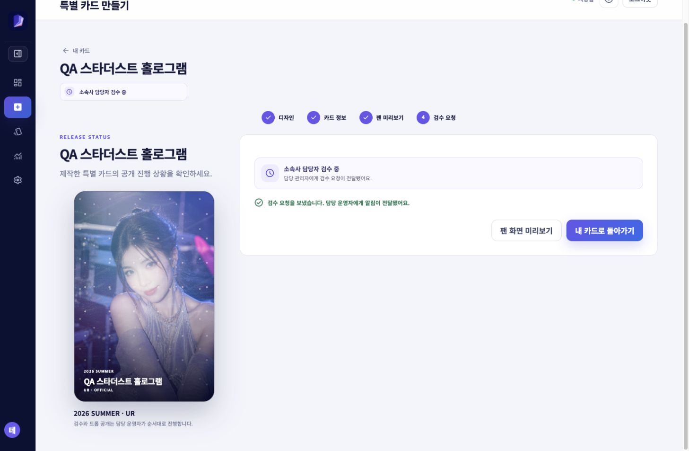
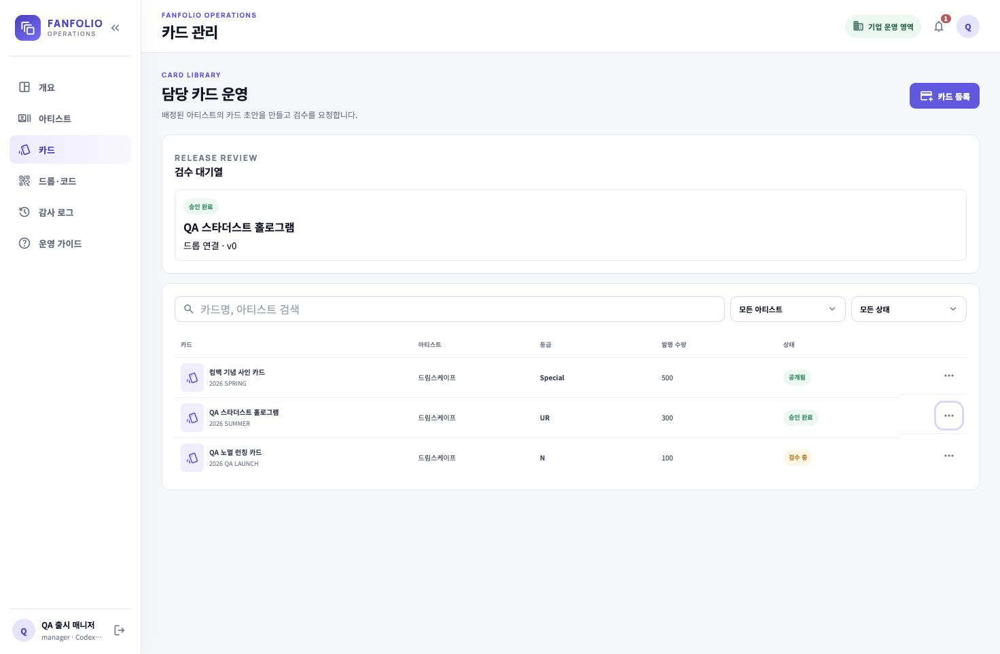
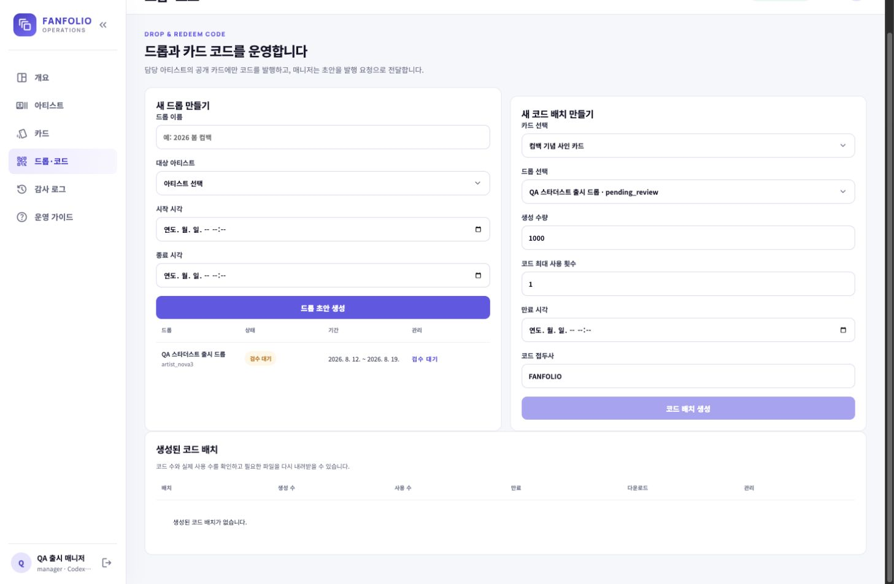

# Fanfolio E2E 출시 시나리오 검증 보고서

검증일: 2026-08-11
범위: 아티스트 스튜디오 → 기업 관리자 검수 → 드롭 발행 요청 → 팬 공개 전 단계

## 결과 요약

특별 카드와 운영 카드의 생성·검수 요청·기업 검수 승인을 실제 배포 환경에서 확인했다. 특별 카드는 회사 검수 승인까지, 운영 노멀 카드는 검수 요청까지 진행됐다. 별도로 같은 아티스트 범위의 드롭을 만들고 발행 요청도 검증했다.

최종 공개와 팬 앱 노출은 아직 완료되지 않았다. 현재 배포 정책상 드롭은 **회사 슈퍼 관리자 또는 지정 승인자**의 별도 승인이 필요하며, 테스트에 사용한 `매니저` 역할은 그 승인을 할 수 없다. 이는 권한 분리 정책이 적용된 결과다.

## 테스트 데이터

| 구분 | 생성·사용 대상 | 역할 / 상태 |
| --- | --- | --- |
| 파트너 | `Codex 저장 검증 564377d` (`codex-save-564377d`) | 기존 활성 파트너 |
| 아티스트 | 드림스케이프 / 유나 | 파트너 범위에 승인되어 있음 |
| 스튜디오 계정 | `test_ko` | 특별 카드 작성에 사용, 최초 비밀번호 변경 완료 |
| 추가 스튜디오 계정 | `qa-artist-0811` | 계정 발급만 검증, 최초 비밀번호 변경 대기 |
| QA 기업 관리자 | `QA 출시 매니저` | 매니저, 드림스케이프 담당 범위로 발급 및 로그인 검증 |
| 특별 카드 | `QA 스타더스트 홀로그램` | 회사 검수 승인 완료, 드롭 연결 미완료 |
| 운영 카드 | `QA 노멀 런칭 카드` | 회사 검수 대기 |
| 드롭 | `QA 스타더스트 출시 드롭` | 발행 요청 완료, 회사 최종 승인 대기 (특별 카드와 직접 연결되지 않음) |

임시 비밀번호와 변경된 비밀번호는 보고서 및 캡처에 기록하지 않았다. 모든 테스트 계정은 실제 운영 전 정리 또는 비활성화가 필요하다.

## 실행 흐름

1. 루트 관리자가 파트너 범위의 아티스트 스튜디오 계정을 확인하고, `test_ko` 계정의 소속을 드림스케이프로 승인했다.
2. 아티스트가 스튜디오에서 **홀로그램 리미티드** 레시피를 선택해 `QA 스타더스트 홀로그램` 카드를 만들었다.
3. 아티스트가 드림스케이프·유나, 시즌, 발행 수량, 홀로그램 효과를 확인하고 검수를 요청했다.
4. 파트너 범위의 QA 매니저 계정을 새로 발급하고, 최초 로그인 및 비밀번호 변경을 완료했다.
5. QA 매니저가 특별 카드의 제출 스냅샷과 메모를 검토한 뒤 **회사 검수 승인**했다.
6. 같은 QA 매니저가 이미지가 있는 `QA 노멀 런칭 카드`를 노멀 등급·100장으로 등록하고 회사 검수를 요청했다.
7. QA 매니저가 같은 아티스트 범위의 `QA 스타더스트 출시 드롭`을 만들고 **발행 요청**을 제출했다. 다만 승인된 특별 카드를 해당 드롭에 직접 연결하는 UI는 확인하지 못했다.

## 증빙

### 1. 아티스트 스튜디오의 검수 요청 완료

아티스트 스튜디오에서 카드가 `소속사 담당자 검수 중` 상태로 전환되고, 담당 관리자에게 검수 요청이 전달된 화면이다.

### 2. 기업 관리자 검수 승인 완료

기업 매니저가 특별 카드의 제출 정보와 검수 메모를 확인한 뒤 승인했다. 카드의 다음 작업은 `드롭 연결`로 변경됐다.

### 3. 드롭 발행 요청 대기

매니저가 만든 드롭은 `검수 대기`가 됐다. 최종 공개 전 승인자가 발행을 승인해야 코드 배치와 팬 노출로 이어진다. 이 드롭은 특별 카드와 자동 연결되지는 않았다.

## 확인된 통제와 이슈

| 항목 | 결과 | 비고 |
| --- | --- | --- |
| 스튜디오 계정의 소속 미승인 차단 | 확인 | 소속 검수 전에는 카드 정보 단계에서 그룹·멤버를 선택할 수 없었다. |
| 파트너 범위 분리 | 확인 | QA 매니저 화면에는 해당 파트너와 배정 아티스트만 노출됐다. |
| 특별 카드 회사 검수 | 확인 | 아티스트 작성 카드에 대해 매니저가 별도 승인할 수 있었다. |
| 노멀 운영 카드 등록 | 확인 | 이미지·아티스트·멤버·등급·수량으로 초안 생성 후 검수 요청까지 가능했다. |
| 드롭 발행 요청 | 확인 | 매니저는 드롭을 만들고 발행 요청을 제출할 수 있다. |
| 특별 카드 → 드롭 직접 연결 | 미확인 / 기능 공백 | 승인된 특별 카드는 `드롭 연결` 상태지만, 드롭 생성 화면에는 대상 카드 선택이 없고 코드 배치에는 이미 공개된 카드만 선택할 수 있었다. |
| 최종 드롭 승인 / 코드 배치 / 팬 노출 | 미완료 | 회사 슈퍼 관리자 또는 지정 승인자 계정으로 남은 승인을 수행해야 한다. |
| 스튜디오 계정 발급 UI | 개선 필요 | 계정 발급 폼의 중복 제출 바인딩 때문에 새 계정 발급 직후 과거 임시 비밀번호 패널이 남아 보이는 현상을 확인했다. 계정 자체는 생성됐다. |
| 기업 관리자 이메일 | 제약 확인 | `.test` 도메인 주소는 서버에서 거부됐고, `fanfolio.com` 형식 주소는 발급됐다. UI가 백엔드 검증 사유를 그대로 보여 주도록 개선하는 편이 좋다. |

## 출시 완료를 위한 남은 작업

1. 회사 슈퍼 관리자 또는 지정 승인자 계정으로 `QA 스타더스트 출시 드롭`을 승인한다.
2. 승인된 드롭에 `QA 스타더스트 홀로그램` 카드를 연결할 수 있는 명시적 UI/API를 제공하거나, 승인 시 자동 연결되는 정책을 구현한다.
3. 코드 배치를 생성하고, 발급 수량·만료 시각을 확인한다.
4. 팬 테스트 계정으로 팬 앱에 로그인해 탐색/컬렉션에서 공개 카드가 보이는지 확인하고 QR·코드 등록을 검증한다.
5. QA 테스트 계정과 테스트 카드·드롭을 정리하거나 비활성화한다.

## 다음 작업 기획: 팬 성장 시스템

출시 흐름이 팬의 카드 소유권 등록까지 완성된 뒤에는, 팬 앱을 **수집 → 업적·미션 → XP·레벨 → 보상 장착 → 다음 드롭 참여** 루프로 확장한다. 우선은 무료 팬 패스로 시작하며, 유료 결제·확률형 보상·거래 기능은 출시 범위에서 제외한다.

### 우선순위

1. 팬 프로필의 대표 칭호·뱃지·프레임 장착
2. 아티스트/멤버/세트 기반 업적과 서버 계산 XP
3. 회사별 업적·보상 초안과 검수·공개 흐름
4. 무료 시즌 팬 패스와 티어 보상
5. 기간 한정 미션과 팬덤 공동 목표

카드 등록은 성장 이벤트의 유일한 신뢰 원천으로 사용한다. 같은 QR·코드를 재시도해도 보상은 한 번만 지급하며, 다른 회사 관리자는 해당 회사의 업적·보상·팬 패스 설정에 접근할 수 없다.

세부 데이터 모델, API 경계, 권한, 화면 구성, 보안·검증 기준은 [팬 성장·업적·무료 팬 패스 설계](../../docs/superpowers/specs/2026-08-11-fan-growth-and-rewards-design.md)를 따른다.
